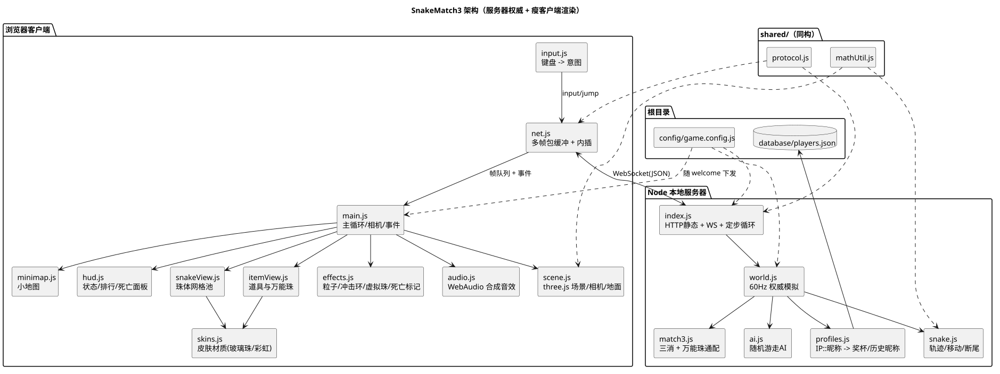
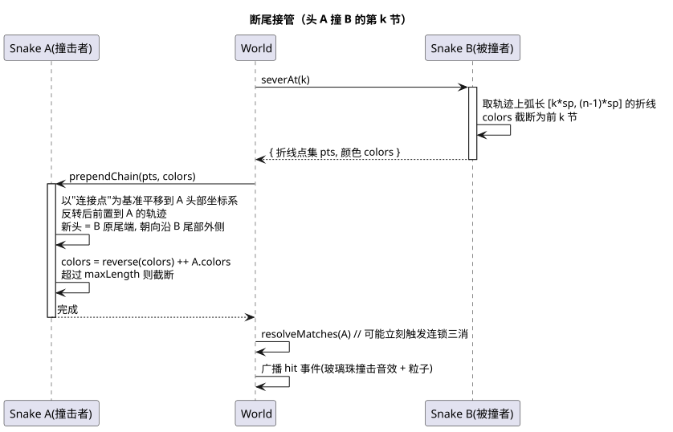
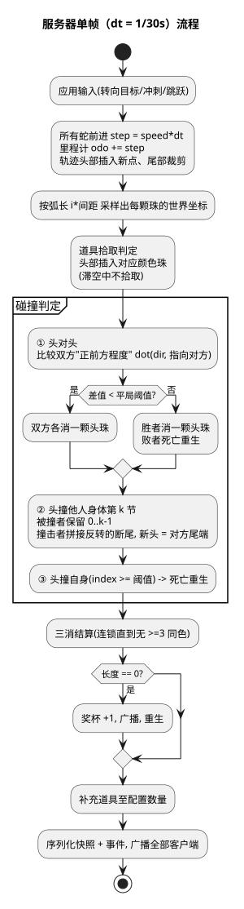

# SnakeMatch3 设计说明

俯视角 · 局域网多人 · 贪吃蛇 × 三消对战。本文档记录实现方案与关键取舍，图见 `docs/img/`（源码在 `docs/*.puml`）。

---

## 1. 需求拆解

| 需求 | 落地方式 |
|---|---|
| 多人局域网、随进随出、免注册 | Node 本地服务器 + WebSocket；连接即给配置，填昵称即入场 |
| 用 IP 等绑定昵称/奖杯 | `database/players.json`，键为 `IP::昵称`，另存每 IP 的历史昵称 |
| 同 IP 多网页多昵称各自成局 | 复合键天然支持；每条连接一条蛇，互不干扰 |
| 经典地图：正方形 + 四边穿越 | 世界是环面（torus）；坐标只在碰撞/渲染时取模 |
| 蛇由多颗彩色球构成 | 颜色数组 `colors[]`，第 0 颗是头 |
| 三颗同色相连消除，长度归零获胜 | `resolveMatches()` 连锁扫描 |
| 吃道具头部加一颗 | `colors.unshift(color)` |
| 头撞身体 → 断尾接管 | 轨迹折线切分 + 反转前置（见 §4） |
| 头撞头 → 比"正前方程度" | 双方 `dot(朝向, 指向对方)` 取大者胜，接近平局则同归于尽 |
| 死亡掉珠、原地停顿、就近重生 | 见 §6 |
| 万能珠定时成簇刷新 | 见 §5 |
| WASD / Shift / 空格 | 目标朝向 + 限速转向；冲刺倍率；抛物线跳跃 |
| 相机俯瞰跟随 | 固定偏航角的透视相机，焦点在环面上平滑跟随 |
| 小地图显示所有人位置 | 2D canvas，逐颗珠画点（见 §8） |
| 可选皮肤，含玻璃珠 | 5 套材质，玻璃珠 = 半透外壳 + 内芯"猫眼" |
| 可配 AI，仅随机移动、不加速 | `AIBrain` 定时随机转向 + 自撞前瞻规避，昵称 bot1/bot2… |
| 不断线重连，重进重开 | 连接断开即移除蛇；无会话恢复 |
| 大量参数可配 | 全部集中在根目录 `config/game.config.js` |

## 2. 架构



**服务器权威**：所有规则判定只在服务器发生，客户端只发意图、只做渲染插值，**不做预测也不做外推**。
理由——碰撞/断尾/三消都是强状态耦合，任何客户端预测都会引入必须回滚的分歧，而局域网 RTT 只有 1~2ms，不做预测的手感损失可以忽略。

`config/` 与 `shared/` 被服务端和浏览器同时加载（浏览器通过 `/shared/*` 静态路由，配置随 welcome 消息下发），配置与协议只有一份定义。

## 3. 蛇的数据结构：里程计 + 轨迹折线

不用格子，也不逐节存位置，而是：

```
snake.odo              里程计，每帧 += speed*dt
snake.trail[]          折线点 {x, y, z, o}，index 0 是最新的头部点
                       某点距头部的弧长 = odo - point.o
snake.colors[]         颜色数组，index 0 是头（-1 表示万能珠）
```

**唯一不变式：第 i 颗珠永远在"从头部沿轨迹回退 i × beadSpacing 弧长"的位置。**

于是所有玩法操作都退化成数组操作，内存单向流动、没有需要同步维护的第二份位置状态：

| 玩法 | 实现 |
|---|---|
| 吃道具变长 | `colors.unshift(c)` — 后面的珠自动沿轨迹后移一格 |
| 三消变短 | `colors.splice(i, n)` — 剩下的珠自动向头部收拢 |
| 头对头消一颗 | `colors.shift()` |
| 跳跃 | 把 `z` 一起写进轨迹点，整条身体像波浪一样跟着跳 |

坐标在内部**不回绕**（连续的 f64），只在输出/碰撞时取模到地图内。这样一条横跨边界的蛇在轨迹里仍然是连续折线，不需要任何特判。

**这条不变式也是客户端插值的基础**：同一个下标在前后两帧代表同一个"槽位"，吃/三消只改变槽位的数量与颜色、不改变槽位几何，所以长度变化不该打断插值（见 §7）。

## 4. 断尾接管



A 的头撞到 B 的第 k 节：

1. `B.severAt(k)` 取出轨迹上弧长 `[k·sp, (n-1)·sp]` 的折线与颜色，B 自身截断为前 k 节。
2. `A.prependChain(pts, colors)` 把这段折线以"连接点"为基准平移到 A 的头部，**反转后前置**到 A 的轨迹。
3. 于是 A 的新头就落在 B 原来的尾端，朝向沿 B 尾部向外——A 会沿着 B 的旧路径倒着开出去。
4. `colors = reverse(断尾颜色) ++ A.colors`，随后立刻做一次三消结算（可能直接连锁）。

因为一切都在同一套"折线 + 弧长"表示里，接管后不需要任何重建，珠间距天然保持连续（回归测试会校验这一点）。

## 5. 三消与万能珠

普通规则是"连续 ≥3 颗同色"。万能珠（颜色编号 `-1`）可以顶替任意颜色，判定改成：

> 一个窗口可消，当且仅当长度 ≥3 且**所有非万能珠同色**（全是万能珠也算）。

扫描时从左往右试每个起点、每个起点尽量向右延伸，取最靠左的可消窗口，消完重扫形成连锁。
关键用例（`[红, 万能, 蓝, 蓝, 蓝]`、`[蓝, 万能, 红, 红]` 这类"左起不成立但右移一位成立"）都有单测覆盖。

万能珠由 `items.wild` 控制：每 `intervalSec` 在随机空位刷一簇 `clusterSize` 颗，受 `wild.maxOnMap` 与全局 `items.maxOnMap` 双重限制。它们和普通道具、死亡掉落共用同一个道具池，唯一区别是补充逻辑只按"普通道具数量"补齐，不会因为场上万能珠多就停止刷普通珠。

## 6. 死亡：掉珠 → 停顿 → 就近重生

1. **掉珠**：所有珠子按当前位置原地变成道具，进普通道具池，谁都能捡（受 `items.maxOnMap` 限制）。
2. **停顿**：蛇进入 `deadUntil` 状态，`colors`/`beads` 清空，`deathPos` 记下头部位置。停顿期间不移动、不参与任何碰撞与三消判定。
   - 这里有个必须挡住的坑：长度为 0 是胜利条件，所以 `resolveMatchesAndWins()` 必须跳过死亡中的蛇，否则一死就白送一座奖杯。回归测试对此有专门断言。
3. **重生**：`deathPauseSec` 到点后在 `deathPos` 半径 `respawnNearRadius` 内找空位重生。半径取 12，小于相机可见半径（约 16 单位），保证一睁眼就能看到死亡点标记。
4. **标记**：客户端在死亡点画一圈脉冲光环 + 一道光柱，从死亡起显示，重生后再保留 `deathMarkerSec` 秒；小地图上同时画一个红色 ⊗。

客户端在死亡停顿期间把相机锁在 `deathPos`，蛇的名牌也挂在那里（显示 ×）。

## 7. 网络与平滑

- 服务器 `tickRate`(60Hz) 定步模拟，每 `framesPerPacket`(2) 帧打一个包广播（30 包/秒），**一个包携带多帧位置**，客户端始终有稠密、真实的位置流可以内插。
- 道具从每帧数据里拆到包级别——它们不会移动，没必要随每帧重复。
- 客户端把渲染时钟落后 `interpDelayMs`(80ms)，在相邻两帧之间插值；跨越地图边界时按**环面最短路**插值，否则会出现横穿整张地图的鬼畜。

实测（默认配置、8 条蛇）单包约 3.8KB，即约 112 KB/s 每客户端；局域网 4 人完全无压力。极端压力配置（12 条蛇挤在 44×44、道具打满上限）约 240 KB/s。

### 曾经踩过的三个坑

1. **快照时间戳字段叫 `t`**，与消息类型字段同名，`{ t: STATE, ...snapshot }` 展开后把类型覆盖成了数字，客户端收不到任何状态。已改名 `st`。
2. **渲染时钟每收一包就"拨表"**（`renderT += (target-renderT)*0.1`，30 次/秒）。收包时刻本身有抖动，这样纠偏会让 `renderT` 非单调，画面就是一顿一顿的。现在改成**微调播放速率**（±10% 钳位），`renderT` 严格单调。
3. **珠数一变就整条蛇吸附到最新帧**。吃/三消时珠数必变，于是每次吃、每次消都整条蛇跳一下——这正是"三消不平滑"的来源。按 §3 的不变式，同下标就是同一个槽位，长度变了照样能插值；只有真正的瞬移（重生、断尾接管，头部一步跨过 3 倍珠距）才需要吸附。

`tests/interp.js` 用带抖动的合成包流驱动真实的 `net.js`，把后两条固化成断言：注入任一旧 bug 都会失败（已验证）。



## 8. 渲染

- **无缝穿越**：相机焦点 `anchor` 始终取模在地图内，任何物体的渲染坐标取"离 anchor 最近的那一份环面代表"。蛇则沿链条逐颗展开（每颗相对前一颗取最短路），跨边界时看起来就是连成一条平滑穿出去。地面是 3×3 张地图大小的重复网格，边界线画 3×3 份，因此任何时候都不会露馅。
- **相机跟随**也在环面上做：先算 `anchor → 目标` 的环面增量再插值，避免穿越瞬间镜头整屏跳一下。瞬移由服务端数据推导出的 `tp` 标志触发吸附，而不是靠"距离大于某个数"的经验阈值。
- **坐标约定**：游戏平面 `(x, y)` → three `(x, z, -y)`，这样游戏 `+y` 就是屏幕上方，WASD 与世界方向一一对应。
- **三消虚拟珠**：服务器在消除前记下那几颗珠的世界坐标随事件下发，客户端在原地生成会上浮、闪烁三下再淡出的"虚拟珠"。真实的珠子是立刻消失的，虚拟珠只负责让玩家看清"刚才消掉的是哪几颗"。
- **小地图**：整张地图缩略图，逐颗珠画点而不是画折线——蛇跨越边界时折线会横穿整张图，画点则天然正确。以 20Hz 重绘，不跟渲染帧率走。

## 9. 平衡性初值（预计同时 4 人在线）

| 参数 | 值 | 理由 |
|---|---|---|
| 地图 | 110×110 | 4 人 + 4 AI 约 3×3 屏，既能遇上又不至于挤成一团 |
| 初始长度 6 / 颜色 4 种 | | 两次三消即可清零，一局节奏 1~3 分钟 |
| 道具 24 个 | | 平均每屏 2~3 个，找色不难但也不能随手就拼 |
| 万能珠 30s 一簇 × 5 颗 | | 稀缺到值得专门跑一趟，又不会破坏常规配色玩法 |
| 速度 8、冲刺 ×1.75 | | 约 4 秒横穿一屏 |
| 转向 3.2 rad/s | | 最小转弯半径 2.5 单位（周长约 16 节）——**只有蛇长超过一圈才咬得到自己**，短蛇天然安全，长蛇才需要小心 |
| 相机距离 28、俯角 64° | | 兼顾"看得清珠子颜色"与"看得到附近的蛇" |
| 出生保护 1.5s / 死亡停顿 3s / 重生半径 12 | | 停顿给足看清死因的时间，重生半径小于可见半径 |

全部在 `config/game.config.js`，改完重启服务器即可（客户端会随 welcome 消息拿到同一份）。

## 10. 规则中的自定义判断

原始需求未覆盖、由实现补齐的几处（都可在配置里调整）：

1. **撞到自己 = 死亡**（`snake.selfCollision`）。需求只写了 AI 要避免自撞。若改成"自己断尾"，玩家可以靠咬自己刷长度归零，是显然的漏洞；死亡则会丢掉当前的消除进度，是有效惩罚。忽略前 4 节以免刚出生就误判。
2. **滞空时不拾取道具**。这让空格除了躲避以外还有正面用途：主动跳过不想要的颜色。
3. **一条蛇每帧只结算一次碰撞**，防止连环判定里同一条蛇被切两次。
4. **头对头接近平局时同归于尽**（差值 < `headOnTieEpsilon`）。

## 11. 测试

- `node tests/sim.js`：把 12 条 AI 塞进 44×44 的地图跑 120 秒，校验坐标非 NaN、不越界、珠数与颜色数一致、
  相邻珠间距不超过 1.6 倍（即断尾接管后链条没断开）、长度不超上限、道具不超上限、
  死亡停顿中不得残留珠子、存活的蛇长度不得为 0（否则就是漏判胜利）、死亡与重生数量配对，
  并要求吃/消除/撞击/死亡/重生/万能珠六类事件都真实发生过。
- `node tests/interp.js`：见 §7。
